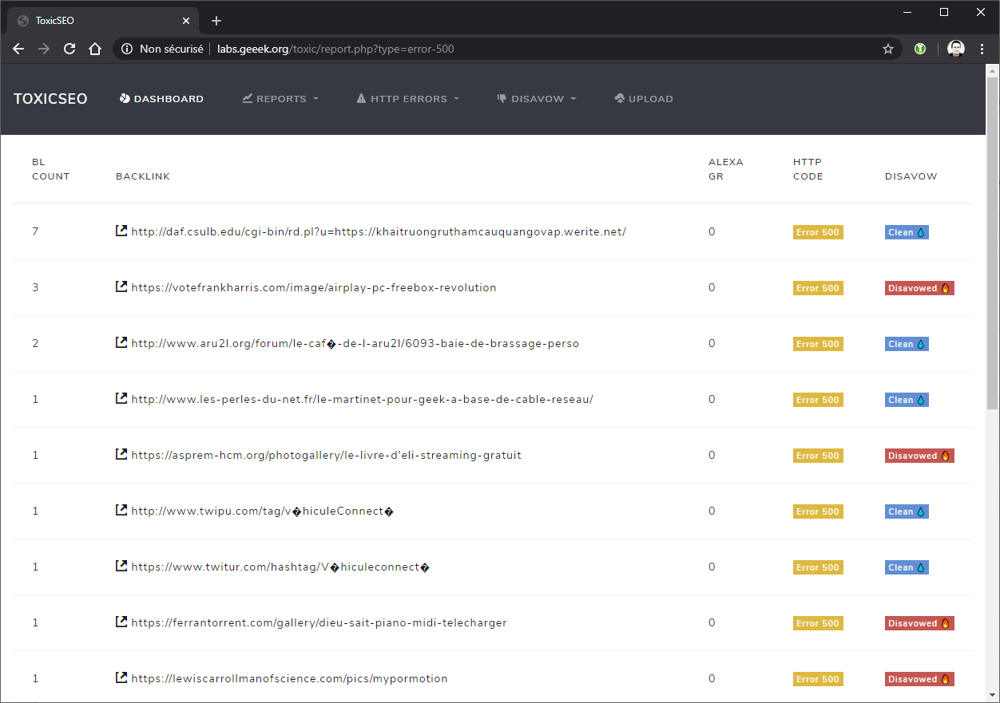

# ToxicSEO
ToxicSEO allows you to import the backlinks from Google Webmaster tools to analyze them and disavow them if necessary.
Its an OpenSource alternative to commercial SEO solution to analyze your Backllinks and manage them.



## Install

Clone the ToxiSEO project on your PHP Webserver.

```bash
$ git clone https://github.com/ltoinel/ToxicSEO.git
```

Copy the default config file.

```bash
$ cp conf/config.php.default conf/config.php
```

Edit the config file with the correct parameters.

```bash
$ nano conf/config.php
```

Set the permissions on the cache and upload directory to you webserver.

```bash
$ chown www-data upload/ cache/
```

Create the MySQL / MariaDB ToxicSeo database and init the database

```bash
$ echo "create database 'toxicseo'" | mysql -u username -p
$ mysql -u username -p toxicseo < db/toxicseo.sql
```

Initialize your database by uploading a CSV file with your backlinks from Google Webmaster tools.